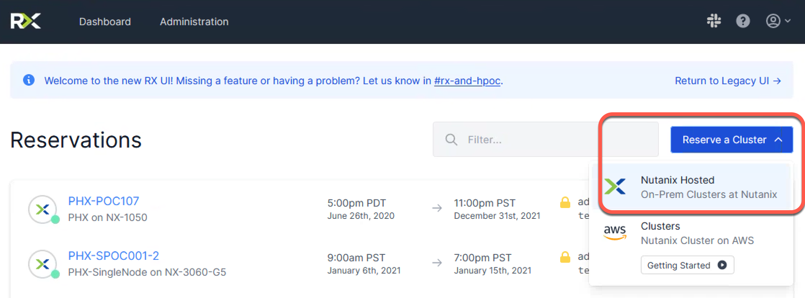
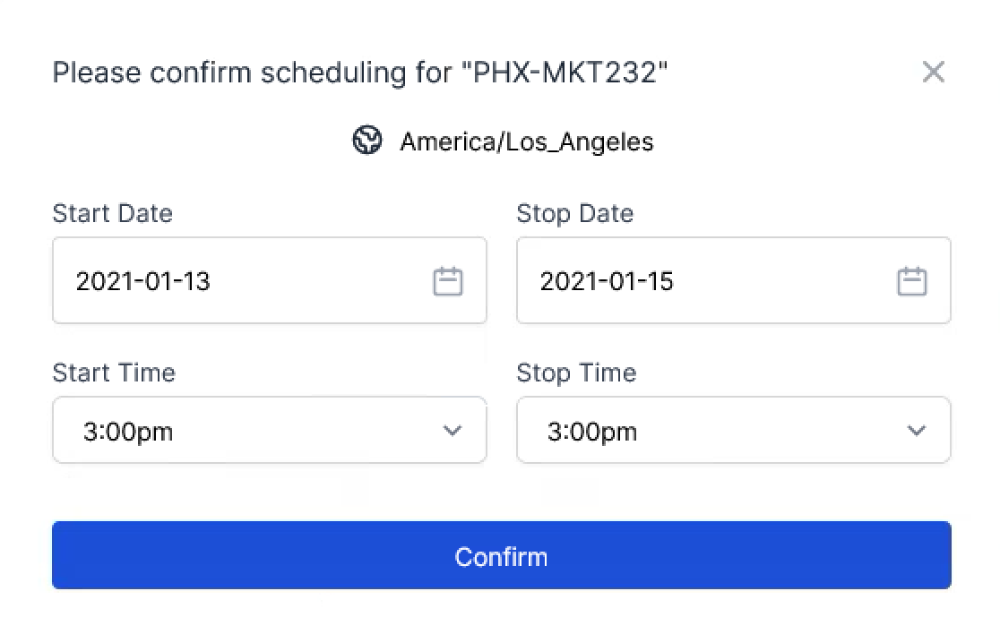
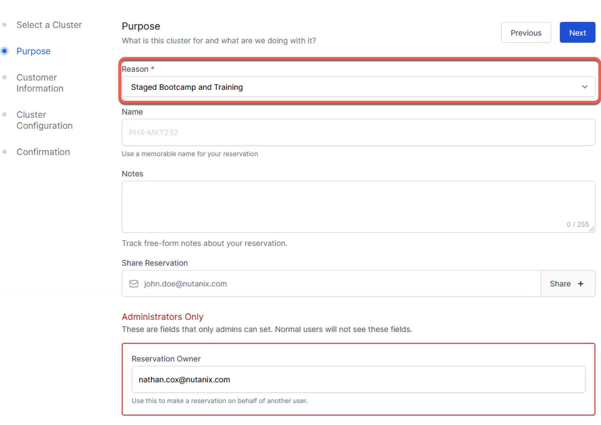
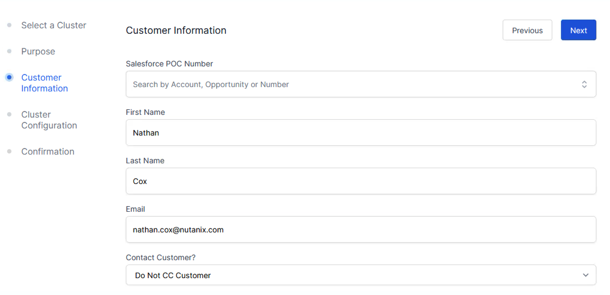
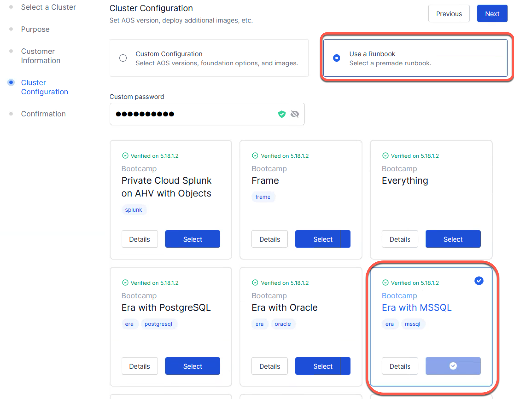

.. _fmm_reserve:

-----------------------------
Reserving A Marketing Cluster
-----------------------------

Generally, you will want to reserve the cluster at least 45 days before your desired event date to ensure Marketing cluster availability. We recommend planning ahead by working with your SE to plan and build out a schedule for the entire quarter.

.. note::

    Feedback and suggestions can be submitted to bootcamps@nutanix.com

Reserving A Cluster
++++++++++++++++++++

When reserving a cluster for your Bootcamp, ensure you are creating the reservation using the correct Hypervisor and AOS version.

#. Click **Reserve a Cluster** > **Nutanix Hosted**

#. Specify "From" and "To" dates: 2 days total (day before and day of bootcamp).
#. Make sure **Mktg-PHX** is selected in the dropdown
#. Click **Confirm**

.. note::

    If this is for an Era Bootcamp, make sure to use an **All Flash** Cluster.

    These will be the **NX-3060-G6 or G7** Clusters

#. For **Select Reason** choose **Staged Bootcamp and Training**. (enter any other relevant information in the Notes field).
#. Share reservation: enter the SE's email address so that they get access to the reservation too and is able to make any changes as needed. (NOTE: Ensure you click the **Share +** character after entering the SE email in the form field)
#. Click on **Next** to get to the next screen.

#. Enter the SEs name and Email on the **Customer Information** Screen
#. Click on **Next** to get to the next screen.

#. Select **Use a Runbook**
#. Leave custom password field blank or enter a custom password if desired.

.. note::

  Warning: if entering a custom passwords note that all passwords get stored in clear text in a database so don't use any real passwords).

#. **Select** the Runbook for the Bootcamp you are running.
#. Click on **Next** to get to the next screen.

#. Click **Confirm** to complete the reservation.

Once the cluster is reserved, SE and FMM will receive a confirmation email, if the FMM shared the reservation. That email contains important reservation and access details for the cluster.

The SE leading the boot camp is responsible for verifying that the foundation succeeded and the cluster is ready for the event. This should be done the **DAY BEFORE** the event so that should there be any complications there is time for the Outcome Engineering (OE) or Technical Marketing Engeering (TME) teams to resolve.

What If No Marketing Clusters Are Available?
++++++++++++++++++++++++++++++++++++++++++++

Check with the SE as they have access to additional clusters.

.. note::

    PHX-SNC (Phoenix Single Node Cluster Pool) is often very open and we’ve recently rolled out the option for SEs to stage some Bootcamps using Single Node Clusters in the staging scripts. Currently there are ~75 single node clusters available in the pool and these are often more available than four node clusters.
    **These will not work for all Bootcamps. Consult with the SE first**

Alternatively, try emailing hostedpoc@nutanix.com to see if they have any clusters set aside that are available for your event date.

Bootcamp Swag & Workbooks
++++++++++++++++++++++++++++++

Bootcamp Swag funded by corporate and ordered by Field Marketing: `Internal Program Store (Program Materials) <https://nutanix.jniwebshop.com/category/16/program-materials>`_

Printable Workbooks funded by corporate and ordered by Field Marketing: `Internal Program Store (Print on Demand) <https://nutanix.jniwebshop.com/category/74/print-on-demand>`_

Need Help?
++++++++++++

If you have any questions or issues on the day of the Bootcamp, please reach out to the OE team at hostedpoc@nutanix.com or `#rx-and-hpoc <https://nutanix.slack.com/archives/C0JSE04TA`_ on slack. You can also ask in the `#technology-bootcamps <slack://channel?id=C0RAC0CHX&team=T0252CLM8>`_ channel in slack.
