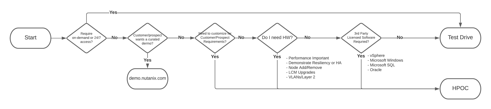

.. title:: Nutanix Workshops HOWTO

.. toctree::
  :maxdepth: 2
  :caption: SE Getting Started
  :name: _se
  :hidden:

  available/available
  create/create
  se_reserve/se_reserve
  access/access
  network/network
  ad_scheme/ad_scheme

.. toctree::
  :maxdepth: 2
  :caption: FMM Getting Started
  :name: _fmm
  :hidden:

  fmm_reserve/fmm_reserve

.. toctree::
  :maxdepth: 2
  :caption: Help
  :name: _getting_help
  :hidden: 

  getting_help/getting_help

.. toctree::
  :maxdepth: 2
  :caption: Virtual Bootcamps
  :name: _vbootcamps
  :hidden:

  vbootcamps/vbootcamps
  vbootcamps/setips
  vbootcamps/fmmtips
  vbootcamps/zoomsettings
  vbootcamps/optimize
  vbootcamps/presentationtips
  vbootcamps/lasttip

-----------------------
Nutanix Workshops HOWTO
-----------------------

The purpose of this living document is to provide a complete reference for Sales Engineers (SEs) and Field Marketing Managers (FMMs) on how to properly run a Nutanix Bootcamp using our `reservation sytem <https://rx.corp.nutanix.com/login>`_ (RX), the Hosted POC environment, and the Nutanix Hands on Workshops platform.

.. note::

    Feedback and suggestions can be submitted to bootcamps@nutanix.com

What are Bootcamps
++++++++++++++++++++

Bootcamps are the way we provide hosted hands on lab experience delivered from our HPOC environments. Bootcamps are consumed by external parties (prospects, customers & partners) via remote desktop sessions which are proctored by SEs virtually or onsite with the attendees. The deployment and confiugration of the clusters with associated products have been incorporated into Runbooks. All of the hands on lab guides are staged online via templates hosted on the Nutanix Bootcamp website.

Bootcamp Format
+++++++++++++++

Bootcamps are run as a 4-5 hour in-person event with lunch and swag included. The overall flow includes a brief presentation that provides a high-level overview of Nutanix and covers features in depth. Presentations are interspersed with demos and hands-on exercises on a live cluster to give participants a feel for the Nutanix environment. Attendees will use an online workbook (created and sent by the SE) to go through the exercises. Printed supplemental workbooks are also provided (ordered by FMMs) so that the attendees can annotate and make notes. The powerpoint slides and demos are arranged to be aligned chronologically with a customer’s Nutanix experience.

Do you want to run a Technology Bootcamp on Test Drive?

Then check out this `Wiki <https://confluence.eng.nutanix.com:8443/display/TDP/Bootcamps+on+Test+Drive>`_ guide on what to consider and how to do so. A few key points to note:
  - Test Drive can be used for running a virtual bootcamp, however it is not a direct replacement for Bootcamps hosted on HPOC, but rather compliments the existing program.
  - Test Drive is not a panacea certain bootcamps/products/solutions cannot be run on Test Drive, use the the following decision chart in order to choose the appropriate platform for your requirement.

  - The cloud is not infinite - if you plan on hosting a virtual bootcamp or event leveraging Test Drive, you must let the Test Drive team know ahead of time using this `form <https://ntnx.wufoo.com/forms/m3d5g6o13dj895/>`_ so adequate resources can be provisioned ahead of time so users aren't left waiting for a Test Drive Cluster to provision.

Ways To Run A Bootcamp
++++++++++++++++++++++

Marketing Event Bootcamp
........................

A Marketing hosted event for prospects to get hands-on with Nutanix solutions.

FMM Handles:

  - Creates Registration page
  - sends event emails
  - Salesforce tracking
  - Reserves the Marketing Cluster
  - Location & Food
  - Swag
  - Printed Materials (If Requested/Needed)

SE Handles:

  - Reserves HPOC if MKTG cluster is unavailable
  - Creates Event Specific Bootcamp from template in the Hands on Workshop platform
  - Takes the created digital workbook link, and sends the to attendees before the bootcamp
  - Stages the Marketing Cluster (or HPOC) with staging script.

Virtual Bootcamp
................

A 4-5 hour prospect or customer bootcamp that is hosted virtually over Zoom.

FMM Handles:

  - Creates Registration page
  - sends event emails
  - Salesforce tracking
  - Reserves the Marketing Cluster
  - Swag

SE Handles:

  - Reserves HPOC if MKTG cluster is unavailable
  - Creates Event Specific Bootcamp from template in the Hands on Workshop platform
  - Takes the created digital workbook link, and sends the to attendees before the bootcamp
  - Stages the Marketing Cluster (or HPOC) with staging script

Account/Partner Based Bootcamp
..............................

This is a more targeted approach to running a Bootcamp. Great way to get a prospect some stick time to accelerate a deal, show an existing customer a product they do not currently use to go wide in the account, or lastly to enable a partner so they can go out and sell for us.

FMM Handles:

  - Creates Registration page
  - Sends event emails
  - Salesforce tracking
  - Reserves the Marketing Cluster
  - Location (if not done onsite) & Food (If not handled by Acct/Channel team)
  - Swag
  - Printed Materials (If Requested/Needed)

SE Handles:

  - Reserves HPOC if MKTG cluster is unavailable
  - Creates Event Specific Bootcamp from template in the Hands on Workshop platform
  - Takes the created digital workbook link, and sends the to attendees before the bootcamp
  - Stages the Marketing Cluster (or HPOC) with staging script

