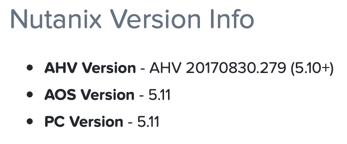
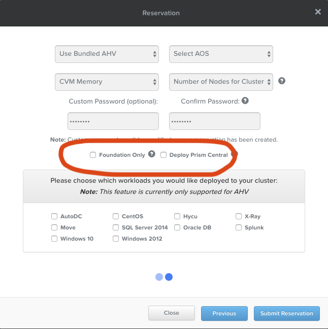

.. _se_reserve:

------------------------
Reserving A HPOC Cluster
------------------------

When reserving a cluster for your Workshop or Bootcamp, ensure you are creating the reservation using the correct Hypervisor and AOS version.

When Reserving an HPOC, for **Select Reason** choose **Staged Bootcamp and Training**.

.. note::

    Making that selection will automatically check the **Foundation Only** box on the next Screen.

When cloning a Workshop or a Bootcamp from a template, the homepage will contain the recommended Hypervisor/AOS versions to configure for your reservation under **Nutanix Version Info**.

- **AHV Version** - Bundled AHV
- **AOS Version** - 5.11.2.3 | 5.15.x | 5.16.1.2
- **PC Version** - 5.16.1.2

**Example:**

If you are unsure which versions to select for a specific template, reach out in either `#technology-bootcamps <slack://channel?id=C0RAC0CHX&team=T0252CLM8>`_ or `#hands-on-workshops <slack://channel?id=C8WLPRTB3&team=T0252CLM8>`_ on Slack.

.. raw:: html

  <strong>Additionally, when creating your reservation, do **not** select Prism Central (PC) or any additional AHV images.</strong>

Images will be uploaded via the script covered in :ref:`stage_environment`.

