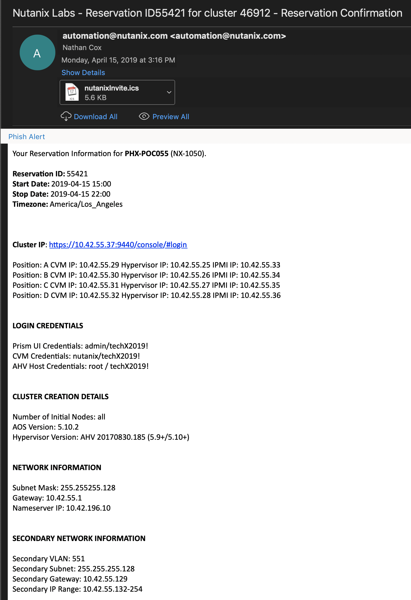

.. _stage_environment:

------------------------
Staging the Environment
------------------------

*The estimated time to complete this is 60 minutes.*

Overview
++++++++

This Exercise will show you how to stage your HPOC or Marketing cluster so you can run a Workshop or Bootcamp.

What Do We Need To Start
++++++++++++++++++++++++

Before we can stage an environment, we will need the Reservation (RX) information. This will give us the **Password** and **Cluster Information** for our HPOC or MKT cluster.

You should have received an email similar to the example below.

Running the Staging Scripts
+++++++++++++++++++++++++++

Now that we have our HPOC / MKT cluster information, lets stage the Environment.

#. Use Terminal or Putty to ssh into a Controller VM (CVM).

.. code-block:: bash

  ssh nutanix@10.42.55.29

#. Now we need to call the staging script. We will use the following command to download and call the **bootstrap.sh** file.

.. code-block:: bash

  curl --remote-name --location https://raw.githubusercontent.com/nutanixworkshops/stageworkshop/master/bootstrap.sh && sh ${_##*/}

#. Next you will be prompted to enter the Clusters **Admin User**, **Admin Password**, and **Admin Email**. The **Admin User** and **Admin Password** map to the **Prism UI Credentials** in the email you received, and the **Admin Email** is your email address.

.. code-block:: bash

  Note: Hit [Return] to use the default answer inside brackets.

  Optional: What is this cluster's admin username? [admin] admin

  Note: Password will not be displayed.
  REQUIRED: What is this PHX-POC055 cluster's admin password?
  CONFIRM:              PHX-POC055 cluster's admin password?

  Note: @nutanix.com will be added if domain omitted.
  REQUIRED: Email address for cluster admin? nathan.cox@nutanix.com

#. Now we need to select the Option we want to Stage. You will see options for **Bootcamp**, **Citrix** (which is under development), and **Tech Summit**.

.. note::

  You need to read this each time, as options may change.

.. code-block:: bash

  
