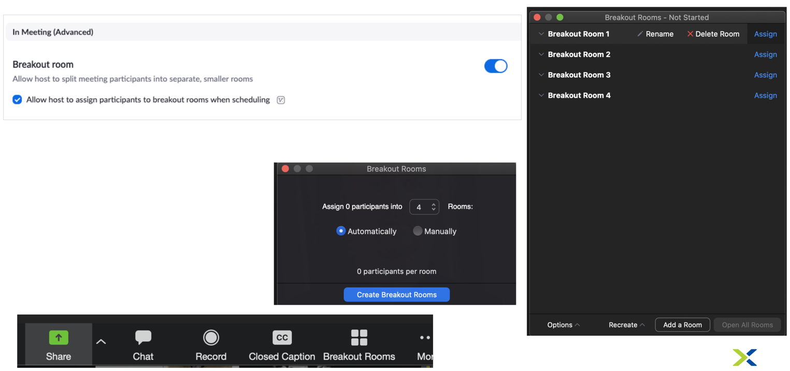

.. _vbootcamps:

----------------------------------
Virtual Bootcamps - Best Practices
----------------------------------

Given the current unique circumstances in the U.S., many events are now being held virtually. Fortunately, most in-person bootcamps can be hosted and run in a virtual meeting environment like Zoom. This doc will outline best practices for SEs and FMMs for hosting a virtual bootcamp using an SE’s regular Zoom account. Please note that each virtual bootcamp will look different depending on the SE’s and FMM’s preferences. All supporting bootcamp materials are currently accessible in digital format and can be found in the resources linked below. We ask that you approach virtual bootcamps with an open mind and as a learning opportunity.

Suggested Bootcamps for Virtual
+++++++++++++++++++++++++++++++

Good for Everyone
.................

This list of Bootcamps should provide the best user experience.

- AOS and AHV
- Enterprise Private Cloud
- Databases with Era (Should have gone through Enterprise Cloud or AOS and AHV)
- Files Bootcamp
- Citrix on AHV (Up to 10-11ppl)
- Frame on AHV *Coming Soon!* (Up to 10-11ppl)

Could use with Prospect or Customer Specific
............................................

Recommend that you the SE are very familiar with the Bootcamp in advance, and have a good understanding of your Audience.

- API Bootcamp *make sure you understand your audience*
- Calm Bootcamp *make sure you understand your audience*

SE Planning Tips
+++++++++++++++++

- **Plan 1-2 months ahead** – Build out a virtual bootcamp calendar with your Field Marketing Manager
    - Work with your FMM to publish and spread the event schedule to all customers / prospects
- **Ensure that you have the cluster at least 24 hours prior to the bootcamp event** - Your Field Marketing Manager will reserve a MKTG cluster if available.
- **Prep before** - Familiarize yourself with Zoom, whiteboarding tools, and dry run with the group of SEs before the event
    - You do not need a special Zoom license. If you do not have a Zoom, ask X-bot in slack.
    - All supporting SEs should go through the bootcamp’s labs before the event so they know which labs are completed during the event.
    - Day before, walk through the PDF document on the clusters to ensure everything is working properly.
- **Send personalized emails to attendees** - Send personalized emails to attendees to remind them of the bootcamp and to provide them login information
    - Email 1 - Day before the event send out personalized emails to every attendee with their login information – `**View Email Copy on Confluence** <https://confluence.eng.nutanix.com:8443/display/SEW/Bootcamps%3A+Virtual+Field+Bootcamps+-+Best+Practices>`_
        - It’s important to send out the connection info the day before and ensure that attendees can login so that any issues can be resolved before the bootcamp and not during.
    - Email 2 - An hour prior to the start of the bootcamp send out one mass email to all attendees with cluster details – Admin login and password – You don’t want to send this earlier to ensure that the cluster is in the expected state – `**View Email Copy on Confluence** <https://confluence.eng.nutanix.com:8443/display/SEW/Bootcamps%3A+Virtual+Field+Bootcamps+-+Best+Practices>`_

FMM Planning Tips
+++++++++++++++++

- **Plan 1-2 months ahead** – Reviewing the data of MKT block reservations, we typically see a lot of availability 30-45 days out. Where possible, planning bootcamps 45+ days in advance will help ensure the availability of cluster resources.
- **Aim for 12-15 attendees per bootcamp** - We recommend keeping these to 12-15 attendees so that the SE can maintain a personalized discussion with attendees.
    - For a larger audience, scale the # of SEs that are helping based on the anticipated size of the audience. Recommendation is for 1 additional SE for every 5-10 attendees.
- **Prioritize Bootcamps based on value** - To-date, it’s been primarily first come/first serve for who books clusters. We ask that you be extra mindful when reserving clusters due to limited cluster availability. Only reserve a cluster for bootcamps that have a qualified audience (i.e. larger audience, closer to a purchase decision, stronger prospects) and de-prioritize those that have an audience of fewer, weaker, and more distant purchasers.
    - **For deprioritized audiences**, leverage **Nutanix Test Drive** where possible – Today test drive covers “Nutanix 101,” “Intro to Calm,” and “Prism Pro.” We are working as a team to onboard more workloads, products, and solutions onto Google Cloud Platform so more and more content that is covered in Bootcamps will be available via Test Drive. Test Drive conveys quite a few benefits:
        - Fewer limits in terms of resourcing since we’re leveraging the Public Cloud (although not infinite)
        - Less time investment required by prospects and customers, as the Test Drive labs are designed to be completed in less than 20 minutes
        - Qualified leads – Test Drive captures key data and statistics and coordinates among Marketo, SFDC, and Adobe Analytics to identify who took which labs, for how long, and if they are an existing customer or new prospect
- **Reserve the cluster for 48 hours** - You will need to reserve a cluster for 48 hours (for the day before and day of the event) so that the SE can foundation and provide logins to end users the day before the event.
    - If DR capabilities are required, consider using the PHX-SingleNode Pool in RX to demonstrate Protection Domains. The PHX-SingleNode pool is available to all SEs
- **Keep Cluster Reservation open to 9pm or few hours past bootcamp hours for attendees to work on labs offline**
- **Leverage Sales HPOC blocks if MKTG clusters are unavailable** – SEs will have access to HPOC blocks other than what FMMs can see – if you are unable to reserve a MKTG cluster, you can see if you can find “green space” on clusters available/accessible to them as their pool is larger than ours. One key thing to highlight is the PHX-SNC (Phoenix Single Node Cluster Pool) is often very open and we’ve recently rolled out the option for SEs to stage some bootcamps using Single Node Clusters in the staging scripts. Currently there are ~75 single node clusters available in the pool and they are often more available than four node clusters.
- **Secure at least two SEs for your event** - You will need to have at least one SE (or more depending on audience) on the zoom to help answer chat questions and to support the SE coordinating the bootcamp.
- **Plan giveaways and/or raffles during the event** - Plan giveaways and/or raffles during the event to keep the audience engaged and encourage participation.
    - Reward the first person to complete a lab, first person to answer a question in chat, Randomly raffle-off items, etc.
    - Giveaway bootcamp backpacks (funded by corporate in the internal store)
    - Fund additional raffles for e-gift cards like Uber Eats, Doordash, Starbucks
- **Build an event landing page** - Landing page copy and email copy for a virtual bootcamp is available in the NRS under “Virtual Technology Field Bootcamp Template”.
    - Make sure to include all relevant time zones in your landing pages and reminder emails if the bootcamp is shared with different time zones (I.e. Mid-atlantic covers both CST and EST)
    - **Shift scheduled In-person bootcamps to Virtual ones** - Change landing page copy and email copy in the event tool so reflect the changes. In the email copy make sure you have a Zoom link in there so they can join during the Bootcamp.

Zoom Settings Best Pracitces
++++++++++++++++++++++++++++

- Make sure you have updated your Zoom profile with a professional picture *(Update your Slack profile with Pic as well while you are at it)*
- **Configure the SE’s Zoom settings** - Make sure that the Zoom is configured and set-up properly before the bootcamp.
    - Audio and video for attendees can be left on to encourage participation.
    - Enable “join before host” and disable participant beeps.
    - All SEs should have cameras ON during activity and cameras OFF during breaks.
    - Supporting SEs should be set to co-host so they can mute/unmute and take additional actions.
- **Start the Zoom meeting 30-60 minutes before the bootcamp and leave it open after bootcamp ends for follow-up questions.**
- Enable video during your bootcamp to better engage your audience.
- Dress as if you were in-person
- Make sure your Office (or where ever you are working) is tidy, and keep Zoom backgrounds professional if you use them.
- At least 2 SEs per vBootcamp
    - One to run the presentation/demos
    - One to monitor the chat for Q’s
- Use transition slides during breaks and labs in progress (do not present a blank screen)
    - Ex. 30-minute Lunch Break - Return at 1pm
    - Ex. Labs in Progress
- Use Zoom Breakout Rooms to distribute participants with an SE in each room to handle questions/troubleshooting for that room
- The SE Hosting the Zoom meeting should manually divide participants between rooms (should be 1 SE per room).
- The Zoom Desktop Client must be used by the host to use Breakout Rooms.
- If the Bootcamp is being recorded, only the main room will be recorded (though users in the breakout rooms can record, screen share in their room locally).

Optimizing Your Workstation for Labs
++++++++++++++++++++++++++++++++++++

- Turn off distracting notifications, close other applications. In particular, close Slack and Outlook.
    - Pro Tip: Mac’s have Do Not Disturb for Notifications!
- If you are sharing out your desktop, make sure to have it organized and with a work appropriate desktop background (i.e., not millions of icons with customer names in them)
- Multi-monitor configurations are the most productive for completing hands on labs, as they allow you to view labs & Prism/vSphere/SSH/etc. simultaneously
- Using a secondary device such as an iPad or Android tablet to open the lab guides on a dedicated screen is helpful, BUT you occasionally will want to copy/paste from the lab guides
- If you have a tablet device and no second monitor, consider one of the software solutions below to use your tablet as a secondary monitor:
    - Duet (www.duetdisplay.com) – Supports Windows/macOS/iPad/Android/Chromebook
    - iDisplay (www.getidisplay.com) – Supports Windows/macOS/iPad/Android

*No spare monitor or tablet? No problem! Follow the suggestions below to increase single monitor productivity:*

- Windows 10
    - **Use the built-in window “snapping”** by dragging your lab guide browser to one side of your screen and Prism/etc. browser to the opposite. “Win+Left Arrow” and “Win+Right Arrow” can also be used to snap windows. Adjust the lab guide to be narrower and expand your other browser as shown.
- macOS
    - **Use Spaces** by full screen maximizing one browser window for your lab guide and a separate browser for Prism/etc. Easily swap back and forth with a three-finger swipe on your trackpad or “Ctrl+Left Arrow” and “Ctrl+Right Arrow” shortcuts.
    - **Use Split View** by clicking and holding the green maximize button and dragging to one side of your screen. Select your second browser window for the opposite side. Use the black bar in the middle to adjust. Split View can be used in combination with Spaces, making it easy to swap to Terminal windows, e-mail, etc.

Presentation Tips
+++++++++++++++++

- **Walk through a presentation deck**
- **Leverage a Whiteboard (physical or virtual)** - If you have a whiteboard at home, consider setting up your camera and using it for diagramming and illustrations. Alternatively, for virtual options:
    - Zoom - Share > Whiteboard
    - Powerpoint - In presenter mode, in the presentation, mouse-over the bottom left corner for annotation options
    - Use a whiteboarding tool:
        - iPad with Pencil
        - MS Surface with Surface Pen
        - SEs can order a Wacom Tablet from Best Buy  – this should be ordered a week or two before the event and can be used for the whiteboarding during the bootcamp:
            - https://www.bestbuy.com/site/wacom-intuos-wireless-graphic-tablet-small-with-3-bonus-software-included-black/6196634.p?skuId=6196634 – a small learning curve on using it
- **Go through the bootcamp’s exercises** - Start the bootcamp and go through step by step on each exercise so users can see what you are doing and they follow with you.
- **Ask the audience questions and/or ask if anyone needs help** - Make sure to ask questions to keep the audience engaged. Ask if anyone needs help with any step as you go through the bootcamp’s exercises.
- **Consider downloading additional tools** - Applications to consider using during the bootcamp (optional and use if it works for you)
    - Krisp noise cancellation - https://krisp.ai/
    - Sketch app - https://www.doodly.com/
