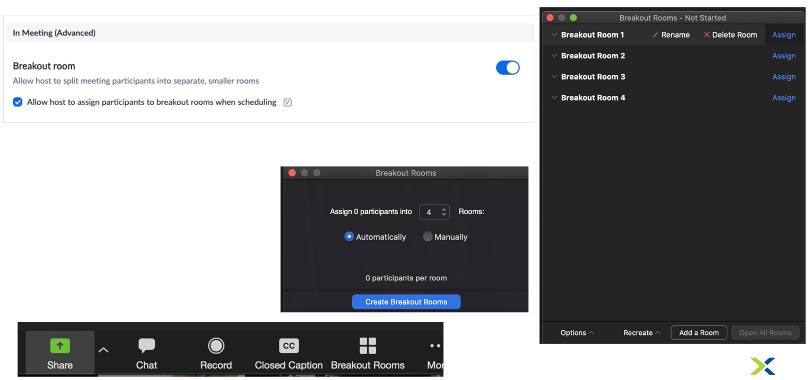

.. _zoomsettings:

Zoom Settings Best Pracitces
++++++++++++++++++++++++++++

- Make sure you have updated your Zoom profile with a professional picture *(Update your Slack profile with Pic as well while you are at it)*
- **Configure the SE’s Zoom settings** - Make sure that the Zoom is configured and set-up properly before the bootcamp.
    - Audio and video for attendees can be left on to encourage participation.
    - Enable “join before host” and disable participant beeps.
    - All SEs should have cameras ON during activity and cameras OFF during breaks.
    - Supporting SEs should be set to co-host so they can mute/unmute and take additional actions.
- **Start the Zoom meeting 30-60 minutes before the bootcamp and leave it open after bootcamp ends for follow-up questions.**
- Enable video during your bootcamp to better engage your audience.
- Dress as if you were in-person
- Make sure your Office (or where ever you are working) is tidy, and keep Zoom backgrounds professional if you use them.
- At least 2 SEs per vBootcamp
    - One to run the presentation/demos
    - One to monitor the chat for Q’s
- Use transition slides during breaks and labs in progress (do not present a blank screen)
    - Ex. 30-minute Lunch Break - Return at 1pm
    - Ex. Labs in Progress
- Use Zoom Breakout Rooms to distribute participants with an SE in each room to handle questions/troubleshooting for that room
- The SE Hosting the Zoom meeting should manually divide participants between rooms (should be 1 SE per room).
- The Zoom Desktop Client must be used by the host to use Breakout Rooms.
- If the Bootcamp is being recorded, only the main room will be recorded (though users in the breakout rooms can record, screen share in their room locally).

